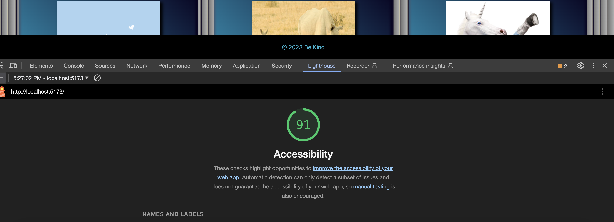

# Horned Beast Project

Author: Stephanie G Johnson

## Links to Page

[Netlify Link](https://luxury-marzipan-b33aff.netlify.app/)

[PR Link](https://github.com/StepheeGee/Gallery-of-Horns/pull/1)

[PR Link Day 3](https://github.com/StepheeGee/Gallery-of-Horns/pull/3)

## Development

Day 1

### Component Structure

11.27.23

Day 2

### React State and Props

11.28.23

#### Number and Name of feature:

* Feature #1: Display Images
* Feature #2: Allow Users to Favorite Individual Beasts
* Feature #3: Bootstrap

#### Estimate of time needed to complete: 

* Feature #1: 90 min
* Feature #2: 90 min
* Feature #3: 120 min

#### Start time:

* Feature #1: 6:30pm 
* Feature #2: 7:15pm
* Feature #3: 9:30pm

#### Finish time:

* Feature #1: 7:15pm
* Feature #2: 9:30pm
* Feature #3: 11:40pm

#### Actual time needed to complete:

* Feature #1: 45 min
* Feature #2: 2hrs 15min
* Feature #3: 2hrs 10min

#### Comments:
If we can't change the html file, then how do we change the main part of our page. I want to increase the margin (left and right) on the main section but not on the body - which includes the header and footer. But there isn't a main element in the index.html file.

I finally got my relative file paths correct. So my files are importing correctly. I was too afraid to try modules.css, because I didn't want to completely break my app again. So I updated the css in index which is global. I would've preferred to add css to the components. For instance, since all my cards are styled the same, that could've been a hornedbeast module.css. 

I also have an error in one of my functions that I can't figure out. In my hornedbeast.jsx file, I have a hornedbeast function. The parameters of the function have squiggly lines and the error states that those parameters are missing in prop validation. But I don't know how to do that. I know that I need those parameters in that function, but I don't know how to make the error message go away. 

How long you spent working on this assignment? 5 hrs

Day 3

### Passing Functions in Props

11.29.23

#### Number and Name of feature: 

Feature #1: Display a Modal

#### Estimate of time needed to complete: 
2 hours

#### Start time:
 7:00pm

#### Finish time:
11:56pm

#### Actual time needed to complete:
A lot

#### Comments:

A question within the context of this lab assignment.

This is not coming together for me for some reason. I'm struggling to understand the difference between useState and this.State. I get that modal is a functional component, so does that mean it gets an exception and is allowed to control state? Because I didn't borrow state from somewhere else for the selected beast file. I used use state and let it manage the functionality for the modal. 

An observation about the lab assignment, or related ‘Ah-hah!’ moment. 

Didn't happen tonight. I couldn't even change the background on my modal. 

How long you spent working on this assignment.

5 hours.

Day 4

### Forms and Filter

11.30.23

#### Number and Name of feature: 

Feature #1: Filter by Number of Horns

#### Estimate of time needed to complete: 
2 hours

#### Start time:
3:00pm

#### Finish time:
8:00pm

#### Actual time needed to complete:
5 hours

#### Comments:

A question within the context of this lab assignment

I'm just really confused. I really need a better way to organize the components and have an idea of how I will pass props before I need to do it. I should've grouped more state variables together for one useState, but I didn't even realize that was possible until my code broke and I had to troubleshoot. 

An observation about the lab assignment, or related ‘Ah-hah!’ moment

I thought I was making great strides in progress once I got my filter working, but then my modal functionality broke. And according to the console, the modal would open but would not close because setSelectBeast was not a function. And that was because I was not passing the prop correctly in the Gallery component. I was also using the hook useState improperly. I got overwhelmed pretty fast, and then I went to chatgpt and asked it to make me a diagram of my files so I could better organize state and see how I was passing down my props. It was a mess but I figured it out.

Here's the diagram:

How long you spent working on this assignment. 5 hours

## Lighthouse
Day 1 -

Day 2 -

Day 3 -

Day 4 -
