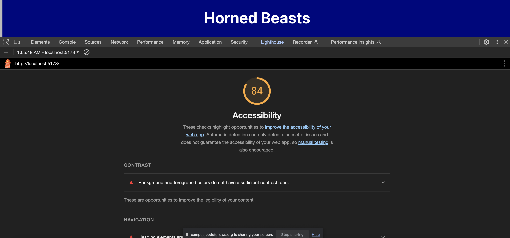
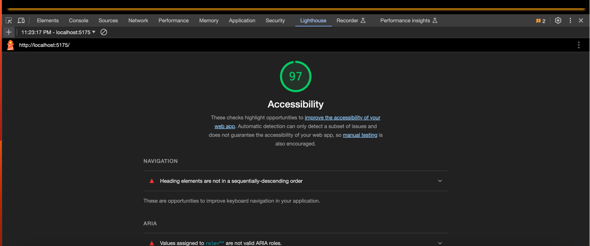

# Horned Beast Project

[Netlify Link](https://luxury-marzipan-b33aff.netlify.app/)

[PR Link](https://github.com/StepheeGee/Gallery-of-Horns/pull/1)

## Development

Day 1

Component Structure

11.27.23

Day 2

React State and Props

11.28.23

#### Number and name of feature:

* Feature #1: Display Images
* Feature #2: Allow Users to Favorite Individual Beasts
* Feature #3: Bootstrap

#### Estimate of time needed to complete: 

* Feature #1: 90 min
* Feature #2: 90 min
* Feature #3: 120 min

#### Start time:

* Feature #1: 6:30pm 
* Feature #2: 7:15pm
* Feature #3: 9:30pm

#### Finish time:

* Feature #1: 7:15pm
* Feature #2: 9:30pm
* Feature #3: 11:40pm

#### Actual time needed to complete:

* Feature #1: 45 min
* Feature #2: 2hrs 15min
* Feature #3: 2hrs 10min

#### Comments:
If we can't change the html file, then how do we change the main part of our page. I want to increase the margin (left and right) on the main section but not on the body - which includes the header and footer. But there isn't a main element in the index.html file.

I finally got my relative file paths correct. So my files are importing correctly. I was too afraid to try modules.css, because I didn't want to completely break my app again. So I updated the css in index which is global. I would've preferred to add css to the components. For instance, since all my cards are styled the same, that could've been a hornedbeast module.css. 

I also have an error in one of my functions that I can't figure out. In my hornedbeast.jsx file, I have a hornedbeast function. The parameters of the function have squiggly lines and the error states that those parameters are missing in prop validation. But I don't know how to do that. I know that I need those parameters in that function, but I don't know how to make the error message go away. 

How long you spent working on this assignment? 5 hrs

Day 3

Day 4

### Lighthouse
Day 1 -

Day 2 -
